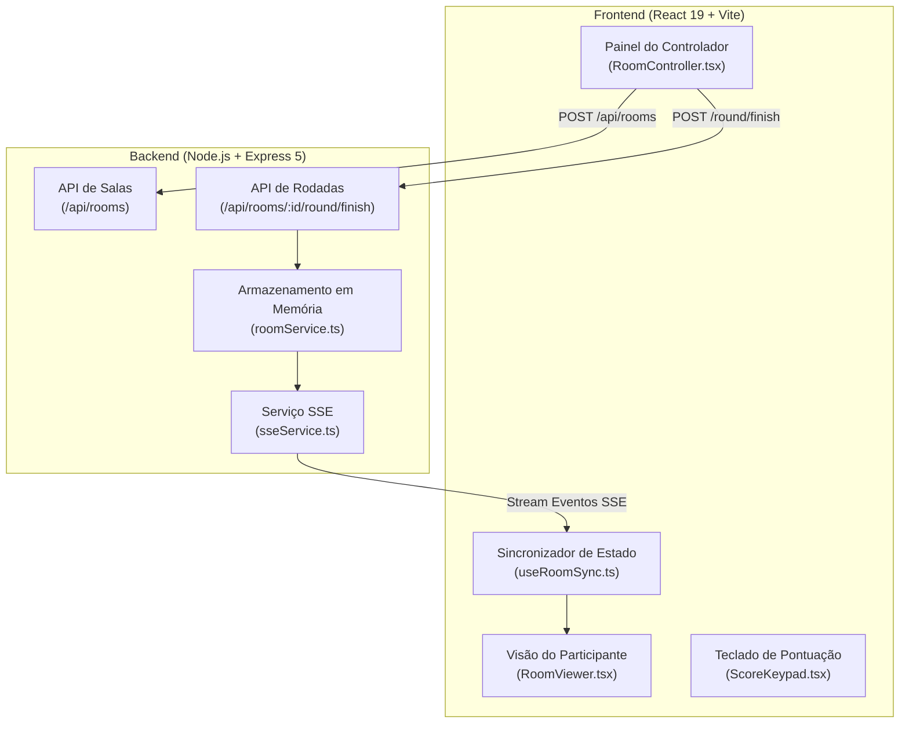

# 🃏 Flip7 Score4All

> **Placar em tempo real, gerenciador de rodadas e suporte a múltiplos dispositivos para o jogo de cartas Flip 7.**

[](https://nodejs.org/)
[](https://react.dev/)
[](https://www.typescriptlang.org/)
[](https://expressjs.com/)
[](https://vitejs.dev/)
[](https://tailwindcss.com/)
[](https://vitest.dev/)
[](LICENSE)

---

## 📌 Visão Geral

O **Flip7 Score4All** é uma aplicação web moderna projetada para transformar a experiência de contagem de pontos e acompanhamento de partidas do jogo de cartas **Flip 7**.

A aplicação divide o fluxo em duas visões sincronizadas:
1. **Painel do Controlador (Mestre da Mesa):** Permite criar salas, adicionar participantes, utilizar um teclado tátil customizado (`ScoreKeypad`) para inserir pontos com rapidez e controlar as rodadas.
2. **Visão dos Participantes / Display Público:** Exibe o ranking geral em tempo real com animações de reordenação (Framer Motion), ocultando pontos parciais durante a rodada ativa até a revelação em lote pelo controlador.

---

## ✨ Principais Funcionalidades

- 🎲 **Controle de Rodadas e Revelação em Lote:**
  - O controlador pode registrar a pontuação de cada jogador durante a rodada sem revelá-la imediatamente aos participantes.
  - Ao clicar em **"Finalizar Rodada"**, todas as pontuações são consolidadas e publicadas simultaneamente para a mesa.
- 📈 **Indicador de Evolução de Ranking (Deltas):**
  - Exibe visualmente quantos lugares cada jogador subiu ou desceu em relação à rodada anterior (`⬆️ 2`, `⬇️ 1`, `➖`).
- ⚡ **Sincronização em Tempo Real via SSE:**
  - Atualização instantânea do ranking entre dispositivos através de Server-Sent Events.
- 🧮 **Teclado de Pontuação Tátil (ScoreKeypad):**
  - Teclado numérico otimizado para dispositivos móveis com suporte a atalhos rápidos e pontuações especiais do Flip 7.
- 🎨 **Design Moderno e Acessível:**
  - Interface responsiva com suporte a modo escuro, alto contraste para daltônicos e atributos ARIA para leitores de tela (`aria-label`).

---

## 🏗️ Arquitetura da Aplicação

O projeto adota uma arquitetura desacoplada composta por um **Frontend em React 19** e um **Backend em Node.js com Express 5**, utilizando TypeScript em ambas as camadas.



---

## 🚀 Como Rodar a Aplicação (Desenvolvimento)

Existem duas formas de executar o projeto localmente para desenvolvimento: utilizando **npm** diretamente em cada subdiretório ou utilizando **Docker Compose**.

### Pré-requisitos

- **Node.js**: v18.0.0 ou superior (recomendado v20 LTS)
- **npm**: v9.0.0 ou superior
- **Docker & Docker Compose** (opcional, para execução containerizada)

---

### Método 1: Execução Manual com npm

Como o projeto possui um frontend e um backend independentes, é necessário instalar as dependências e iniciar o servidor em ambos os diretórios.

#### 1. Clonar o repositório
```bash
git clone https://github.com/alison-ferreira/flip7-score4all.git
cd flip7-score4all
```

#### 2. Configurar e iniciar o Backend
Em um primeiro terminal:
```bash
cd backend
npm install
npm run dev
```
O servidor backend será iniciado na porta **`http://localhost:3000`**.

#### 3. Configurar e iniciar o Frontend
Em um segundo terminal:
```bash
cd frontend
npm install
npm run dev
```
O servidor de desenvolvimento do Vite será iniciado em **`http://localhost:5173`**.

Acesse `http://localhost:5173` no seu navegador!

---

### Método 2: Execução com Docker Compose

Você também pode subir toda a infraestrutura com um único comando utilizando Docker Compose:

```bash
docker-compose up --build
```

Os serviços estarão disponíveis em:
- **Frontend:** `http://localhost:5173`
- **Backend (API & SSE):** `http://localhost:3000`

---

## ⚙️ Variáveis de Ambiente

### Backend (`backend/.env`)
Consulte o arquivo [`backend/.env.example`](file:///home/alison/workspace/flip7-score4all/backend/.env.example):
```env
PORT=3000
NODE_ENV=development
```

### Frontend (`frontend/.env`)
Consulte o arquivo [`frontend/.env.example`](file:///home/alison/workspace/flip7-score4all/frontend/.env.example):
```env
VITE_API_URL=http://localhost:3000
```

---

## 🧪 Testes e Qualidade de Código

O repositório possui suítes de testes unitários e de integração com cobertura rigorosa de código, além de linters e verificações de tipos estáticos.

### Backend

```bash
cd backend

# Executar testes unitários e de integração com relatório de cobertura (Vitest)
npm test

# Verificar tipos TypeScript
npm run typecheck

# Compilar para produção
npm run build
```

### Frontend

```bash
cd frontend

# Executar testes de componentes e hooks com Vitest
npm run test

# Executar linter (ESLint)
npm run lint

# Verificar tipos TypeScript
npm run typecheck

# Compilar build de produção
npm run build
```

---

## 📁 Estrutura do Repositório

```text
flip7-score4all/
├── backend/                  # Servidor API HTTP & SSE (Node.js + Express + TypeScript)
│   ├── src/
│   │   ├── routes/           # Rotas da API (/api/rooms, /api/rooms/:id/round)
│   │   ├── services/         # Regras de negócio e armazenamento (RoomService, SSEService)
│   │   └── index.ts          # Ponto de entrada do servidor Express
│   └── package.json
│
├── frontend/                 # Aplicação SPA Web (React 19 + Vite + Tailwind CSS)
│   ├── src/
│   │   ├── components/       # Componentes (ScoreKeypad, DeltaIndicator, PlayerRow)
│   │   ├── hooks/            # Custom Hooks (useRoomSync para sincronização SSE)
│   │   ├── pages/            # Telas (Home, RoomController, RoomViewer)
│   │   └── lib/              # Integração de API e utilitários de pontuação
│   └── package.json
│
├── e2e/                      # Suíte de testes Ponta-a-Ponta (Playwright)
├── tasks/                    # Documentos de especificação e controle de tarefas (PRDs, TechSpecs)
├── docker-compose.yml        # Configuração do ambiente Docker
├── CONTRIBUTING.md           # Guia de contribuição para desenvolvedores
└── LICENSE                   # Licença MIT
```

---

## 🤝 Contribuição

Contribuições são super bem-vindas! Por favor, leia nosso arquivo [`CONTRIBUTING.md`](file:///home/alison/workspace/flip7-score4all/CONTRIBUTING.md) para saber mais sobre os padrões de código, fluxo de trabalho com Git e execução dos testes antes de abrir uma Pull Request.

---

## 📄 Licença

Este projeto está licenciado sob a licença [MIT](file:///home/alison/workspace/flip7-score4all/LICENSE).
